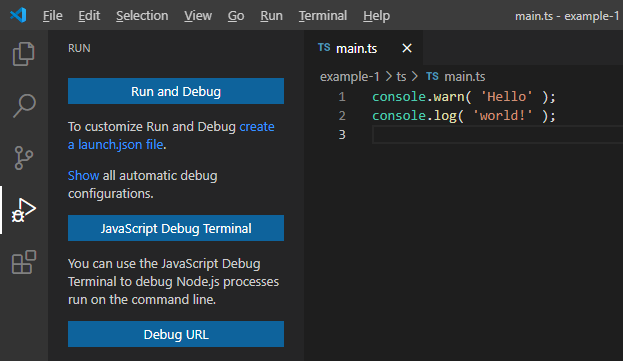
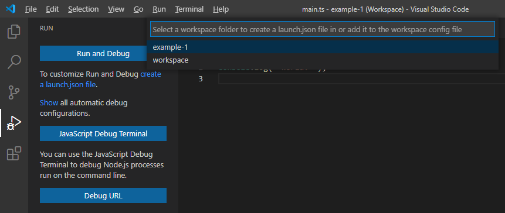
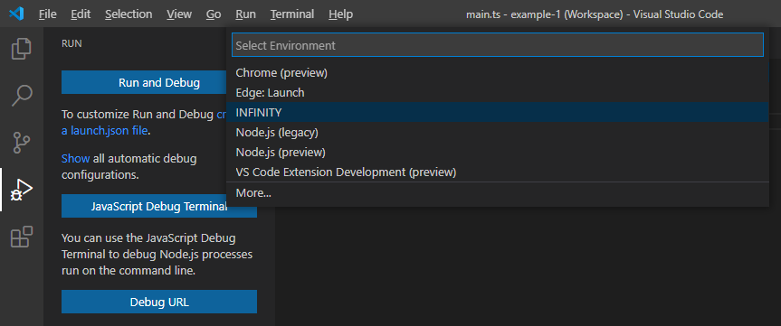
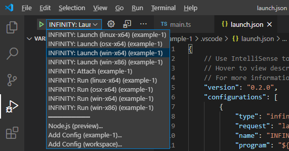
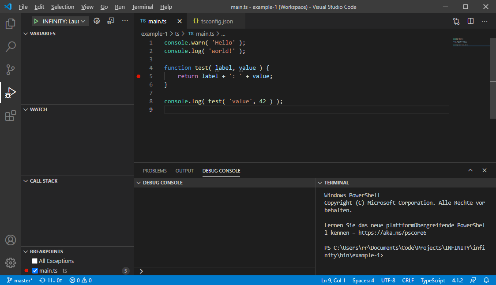
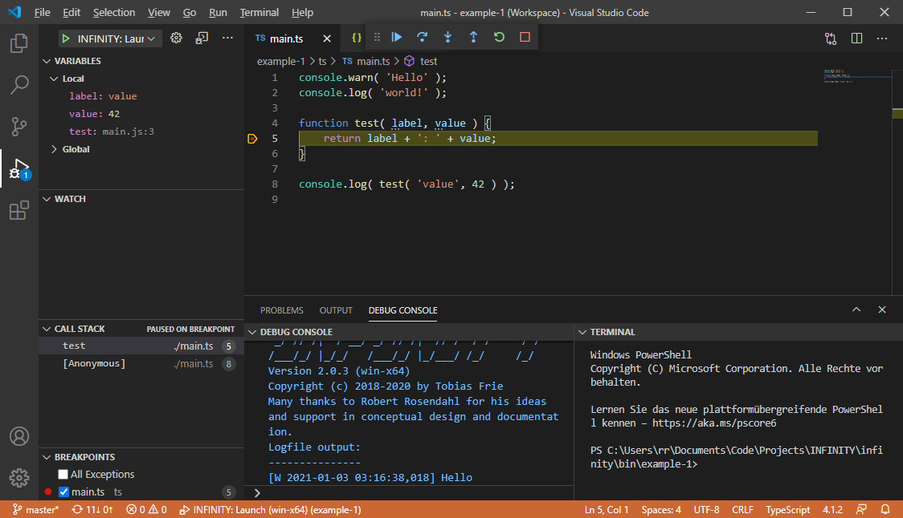

# Debugging

Now that the project has been compiled, it's time to test it. If you have installed the INFINITY.JS extension in Visual Studio Code, then you need to create a launch configuration for the debugger, first. Go to the "Run" view of the IDE by clicking the play button icon with the small bug in the left hand side toolbar or by pressing `ctrl+shift+d` ("d" for "debug").



There is a link called "create a launch.json file", which you should click. The IDE will then ask you in which workspace the launch configuration should be created. Just select your project folder ("example-1" in our case):



Then it will ask you for which debugging environment you would like to create the launch configuration. Select "INFINITY.JS":



This will create a `.vscode/launch.json` file in your project workspace that contains the debug and run configurations for the various platforms. You can now select the launch configuration that you want to use - choose the "INFINITY.JS: Launch (...)" entry for your platform from the drop down at the top of the debug sidebar:



You're now all set up to run your program inside the debugger by pressing the `F5` function key or by selecting "Start Debugging" from the "Run" menu of Visual Studio Code.

> Note: if the output of the INFINITY.JS runtime in the debug output area of visual studio code seems
> incomplete, or your source code isn't executed, then you may need to make sure that any anti-virus
> software on your computer is not interfering with it. Anti-virus tools might block the debug port
> of the INFINITY.JS runtime if their heuristics consider this a potentially harmful behavior.
> In that case, you may need to add the folder containing the INFINITY.JS runtime executable to the
> list of folders that your anti-virus software should ignore.

Let's add some more code to our example `main.ts` file to demonstrate the debugger:

```typescript
console.warn( 'Hello' );
console.log( 'world!' );

function test( label, value ) {
    return label + ': ' + value;
}

console.log( test( 'value', 42 ) );
```

Then move your mouse cursor to the left of the line number of the final `console.log()` statement. A red dot will appear, indicating that you can add a breakpoint at this line. Go ahead and click on the dot. It will now light up and stay lit when you move the mouse cursor away:



Make sure that your program has been compiled - e.g. by having pressed `ctrl+shift+b` and selecting "tsc: watch". You can see the terminal output of the compiler in the lower right panel of the screenshot.
Now run the program in the debugger by pressing the `F5` function key (or select "Start Debugging" from the "Run" menu). Visual Studio Code will now run your program in the debugger and interrupt the execution at the line at which you have placed the breakpoint:



The debugger sidebar shows the local variables (the function parameters) in the "Variables" section on the top left and it will also show you the current call stack further below. Execution has been halted on line 5 of `main.ts` in the `test` function, which was called from line 8 of `main.ts` from an anonymous function (since it is the global scope of the main program).

Also note the "Breakpoints" list on the lower left hand side. There's a checkbox called "All Exceptions". If you activate that checkbox, then the debugger will automatically break when the runtime encounters an unhandled exception. That can be quite useful when tracking down runtime exceptions.

There is also a toolbar at the top of the window that lets you continue your program step by step, or until the next breakpoint is hit. You can also abort execution by hitting the stop button. Just hit `F5` (or the play button) again to continue execution. The program will now finish and you will notice that the final `console.log()` has appeared after you have pressed `F5` again.

> Note: If you only get the first line ("Hello"), then you didn't set the log level to zero in the `infinity.ini` file (refer to the [Setup](setup-development.md#infinity-config-file) tutorial).
>
> Note: If you don't see any output and the debugger toolbar does not appear, then make sure that you have selected the launch configuration for your platform. If you choose "INFINITY.JS: Launch (linux-x64)" on Microsoft Windows, then Visual Studio will fail to execute the INFINITY.JS Linux runtime and thus produce no output.
>
> Note: If you get an error message about missing source map files or line number mappings, then you probably didn't include the `"sourceMap": true` line in your `tsconfig.json` typescript compiler configuration (refer to [Setup Project](setup-project.md#typescript-compiler-configuration)).
>
> Note: If you get an error telling you that the source program cannot be started, then the compiled javascript file is probably missing. Make sure you started the compiler before running the debugger, by pressing `ctrl+shift+b` and selecting "tsc: watch" (or "tsc: build"). Also check the terminal in Visual Studio Code for any compiler warnings or errors. If there's a syntax error in your typescript code, then the compiler will fail to compile the javascript file from it.

Now that you have your basic project structure and are able to run and debug your code from within the IDE, we'll finish this quick start guide by showing you how to package your program for distribution: [Package Project](package-project.md)
