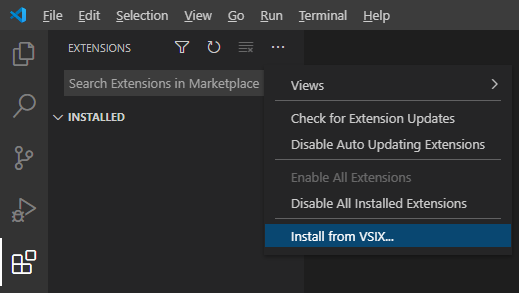

# Setup

To start you own project based on INFINITY.JS, you will need to setup the INFINITY.JS runtime, a TypeScript compiler and a text editor or IDE - preferably with support for the typescript or at least javascript programming language.

Although INFINITY.JS is actually a javascript runtime, we will be using typescript in this tutorial, since it offers some advantages over javascript, like detecing errors at compile-time or indicating mismatched types.
You can stick to plain javascript if you like, but you'll have to make some changes to the configuration files we'll be creating in this tutorial, and you would skip the "Setup TypeScript" step, of course.

We'll show you how to set up your development environment and get started using the free Visual Studio Code IDE, with support for running and debugging your application from within the IDE.


---


## Setup INFINITY.JS

To get started, you first need to unpack the INFINITY.JS runtime into a folder of your choice. In this tutorial, we will unpack it and put it into a folder called "infinity". Inside that folder there is a `bin` folder, containing the runtime executables for all supported platforms and a `resources` folder with platform-independent support files. While you can put your own project files anywhere you want, we will put them inside the `bin` folder, next to the platform binaries folders. In our example, we will call the project "example-1":

```
+ infinity
  + bin
    + resources
    + example-1
```

> Hint: If you're on the Microsoft Windows operating system, then you need to install the VC-Redist package in the `infinity/redist` folder (there's one for 32-bit and one for 64-bit systems).


### INFINITY.JS Config File

There's one important file you need to know about: in the same folder as the infinity executable of your platform, there is an `infinity.ini` file. This is the configuration file for the INFINITY.JS runtime. It contains some settings that control the runtime, like script pool size and log files.

> Note: If it is missing, then you can create it by copying the `infinity.default.ini` file to `infinity.ini`, or you can run the infinity executable once (`infinity` or `infinity.exe`) - it will then create the config file.

Since we'll be using the console log output in our tutorials, you need to edit the infinity.ini file and change the line

```
MinLogLevel=1
```

to a log level that will not only show errors and warnings, but also info level output:

```
MinLogLevel=0
```

Also make sure that you include the `[MimeTypes]` section from the `infinity.default.ini` file in your `infinity.ini`. Otherwise the mime type detection functions in the `infinity.mimeType` module won't work.

---


## Setup TypeScript

In this tutorial, we will show you how to setup your project for typescript source code and have the Visual Studio Code IDE automatically transpile the typescript files into javascript files, which will then be run by the INFINITY.JS runtime. Don't worry - the IDE is going to do all that for you.

> Hint: You can, of course, write your application in plain javascript, but you'd be missing out on a lot of convenient advantages that typescript provides. If you want to stick to plain javascript, then you can ignore everything related to typescript and just create javascript `.js` files instead of typescript `.ts` files, but you'll have to change some of the configuration files introduced below to have the IDE run your javascript source files in INFINITY.JS.

The easiest way to install the typescript compiler is through npm (Node.js package manager). This means you'll also have to install npm, but that will also make updating the typescript compiler fairly easy.

You first need to download the npm installer for your platform:
https://nodejs.org/en/download/

Once you've installed npm, open a command shell and install the typescript package:

```shell
npm install -g typescript
```

The `-g` parameter tells npm to install typescript globally on your computer, instead of just installing it into the current folder (the current folder of your command shell). You might need to run the command with administrator privileges (sudo on Linux and Mac OS, an Administrator PowerShell on Windows).

To make sure that the typescript compiler is working, let it output its version number in a command shell:

```shell
tsc --version
```

> Note: If the tsc command is not found, then you might need to close the shell and open a new one as the path environment might not have been updated, yet.

> Note: If you're on Windows and run into an error telling you that the `tsc.ps1` script could not be run on, then you have two options: either delete the file `tsc.ps1` from the `AppData/Roaming/npm` folder in your user profile folder, or change the PowerShell script execution policy to "Bypass". We recommend removing (or renaming) the `tsc.ps1` script and not change the security policy. It is recommended to restart Visual Studio Code after carrying out this modification.
Explanation: If the `tsc.ps1` file is present, then Windows will prefer it over the `tsc.cmd` command - and if the security policy has been set up to not allow PowerShell script execution, then it will fail. Removing the `tsc.ps1` file will result in the `tsc.cmd` file being run, which does not cause issues with the PowerShell script policy.


---


## Setup Visual Studio Code

Next, download and install Visual Studio Code from:
https://code.visualstudio.com

You should also install the INFINITY.JS extension for Visual Studio Code so that you can run your project inside the debugger within the IDE. You can find the extension package in the `tools` folder of INFINITY.JS. The file is called `infinity-*.vsix`. You can install it into Visual Studio Code by opening the "Extensions" view in the left hand side toolbar and choosing "Install from VSIX..." from the three-dot menu at the top:



> Hint: If english is not your mother tongue, then you might want to check if a Visual Studio Code localization pack is available in your preferred language. You can use the search function of the "Extensions" view to look for language packs and additional extensions.

You now have everything that you need to get started writing applications with INFINITY.JS. We will show you how to set up your first project and configure it so that Visual Studio Code can compile it from typescript to javascript and run it in the INFINITY.JS runtime in the next tutorial: [Setup Project](setup-project.md)
