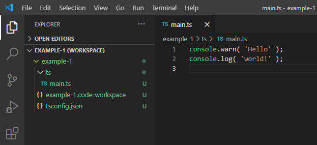
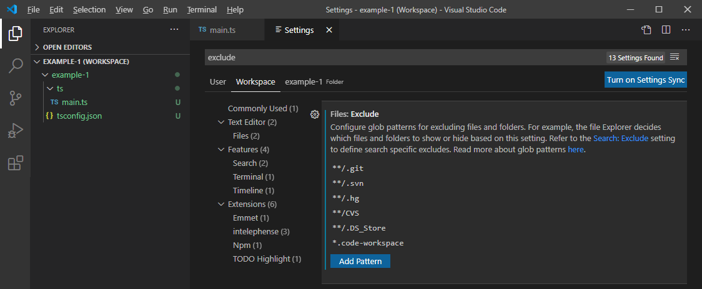

# Setup Project

Now it's time to start your own project. Create a folder in the `infinity/bin` folder. We will name the project folder `example-1`, but you can choose any name you like.

Inside the project folder, create a `ts` folder for your typescript source code files. Inside that folder, create a typescript file called `main.ts` which will serve as your application's main file or entry point.

The typescript compiler will compile your `.ts` typescript files from the `ts` folder (and sub-folders) and place the resulting `.js` javascript files into a folder called `js` next to your `ts` folder. Your folder structure will eventually look like this:

```
+ infinity
  + bin
    + resources
    + example-1
      + js
        - main.js
      + ts
        - main.ts
```

The `js` folder with the `main.js` won't be there, yet, of course. We will now show you how to let the IDE create those for you.

> Note: We are using typescript in this example. If you want to stick to plain javascript instead,  then don't create the `ts` folder with the `main.ts` file and instead create the `js` folder with the `main.js` file by hand. You will be editing the `.js` files directly then, instead of compiling them from `.ts` typescript files.


---


## Visual Studio Code Workspace

Start Visual Studio Code and from the `File` menu, choose `Add folder to workspace...` to select your `example-1` project folder and add it to the IDE workspace.

> Hint: If you've already been using Visual Studio Code, then close your current workspace before adding the folder.

Then, save the workspace so you can reopen it later: choose `Save Workspace As...` from the `File` menu and save the workspace into the `example-1` project folder (you can call the file `example-1`, too). If you work on multiple projects you can easily switch between them using the `Open Recent` submenu from the `File` menu.

> Hint: When holding the shift key while clicking on a project from the `File > Open Recent` menu, then Visual Studio Code will open it in a new window instead of the existing one.  
By default, Visual Studio Code will open further windows in smaller size, but you can change the settings so that new windows will inherit the position and size from the existing one: open the settings by choosing `File > Preferences > Settings` and in the new settings editor window, simply start typing `newWindow` in the search bar. This will show you the setting "New Window Dimensions", which you can change from `default` to `inherit`. Make sure to save the settings by saving the settings file in the editor tab (just press `ctrl+s` as you would for saving any other file).

If you don't see your project folder and files in Visual Studio Code, yet, then click on the top icon of the left-hand toolbar - the one with the to file icons. This will open the explorer.



Since you won't edit the `example-1.code-workspace` Visual Studio Code workspace configuration file by hand, you might as well hide it from the explorer view. From the "File" menu, select "Preferences" and then "Settings" (or press `ctrl+,`) to open Visual Studio Code's settings page. At the top you can switch between "User", "Workspace" and "Folder". Since you want to hide the workspace config file in the current workspace only (and not globally across all projects), click on "Workspace". Then enter `exclude` in the search bar at the top, which filters the settings. You should find the "Files: Exclude" setting, where you can define file patterns that the file explorer should hide. Click "Add Pattern" and enter `*.code-workspace`. Then press `ctrl+s` to save the settings and the Visual Studio Code workspace config file should vanish from your file explorer view in Visual Studio Code:



---


## First Source Code File

Create a file called `main.ts` inside the `ts` folder of your project. Just copy the following lines into it for a quick demo:

```typescript
console.warn( 'Hello' );
console.log( 'world!' );
```

> Hint: You can use quotation marks (`"`) or single quotes (`'`) in typescript and javascript. We're using single quotes in this tutorial, since they're a bit "lighter" to read.

> Hint: You can open multiple files inside the IDE next to each other. Just drag the tab of one of the files to the right or bottom edge and Visual Studio Code will show a shaded area to indicate where the file will be placed, splitting the view as required. That means you can have one file open in the left half of the editor area and a second and third on the right, in the upper and lower half.  
You can also right click on the tab of a file and choose to split it. This can be convenient if you need to compare two sections of the same file.

We now have our first source code file, but since INFINITY.JS is a javascript runtime and not a typescript runtime, we need to set up our project so that javascript files are automatically compiled from the typescript source files.  
We will need to set up a config file for the typescript compiler and a tasks file for Visual Studio Code that will add commands for compiling and running the project.


---


## TypeScript Compiler Configuration

Add a "tsconfig.json" file to your project folder: `example-1/tsconfig.json`

Just copy the following code into it:
```json
{
    "compilerOptions": {
        "target": "es5",
        "lib": [
            "es5"
        ],
        "module": "none",
        "types": [],
        "removeComments": true,
        "outDir": "js/",
        "emitBOM": true,
        "noFallthroughCasesInSwitch": true,
        "noUnusedLocals": true,
        "strict": false,
        "strictPropertyInitialization": false,
        "esModuleInterop": true,
        "sourceMap": true
    },
    "include": [
        "../resources/infinity.d.ts",
        "**/*"
    ]
}
```

This will tell the typescript compiler to compile all `.ts` files within your project (the `**/*` in the `include` setting) and put the resulting `.js` files into the `js` folder of your project (the `js/` in the `outDir` setting). The typescript compiler will create ECMAScript 5 compatible javascript code (because of the `es5` in the `target` setting). The `"sourceMap": true` line will tell the compiler to create `.js.map` files alongside the compiled `.js` files. These map files contain line number mappings between the typescript source files and the compiled javascript files so that the debugger will know which line numbers from the INFINITY.JS runtime will correspond to which lines in your source files. You don't have to take care of that, you will just need the `sourceMap` line in your `tsconfig.json` if you are going to use the debugger.

In addition to that, the `../resources/infinity.d.ts` value in the `include` setting will let the compiler know of all the namespaces, classes and functions from INFINITY.JS's runtime library. Otherwise it would complain about the `console` namespace and the `log` and `warn` functions in your `main.ts` file. Visual Studio Code will also take the declarations from the `infinity.d.ts` file and warn you about syntax errors and offer code completion inside the IDE editors.

The `infinity.d.ts` entry will also enable code completion for the INFINITY.JS runtime library. Try typing `infinity.` in your `main.ts` file. The code completion should be displayed, showing you the available namespaces of the INFINITY.JS engine. You can also try this by placing the cursor behind the dot on one of the `console.` lines in your `main.ts` and pressing `ctrl+space`. This will bring up the code completion for the `console` namespace.

> Note: if the code completion popup doesn't show up automatically, you can press `ctrl+space` to bring it up.

So, the typescript compiler will know how to compile our source files. But how do we tell the IDE to actually run the compiler? Although Visual Studio Code has some typescript support built-in, we will create a so-called "tasks" file to add some commands to the IDE that will allow us to compile the source code and run the project inside a terminal area within the IDE.


---

## Compiling from within the IDE

Visual Studio Code will detect the `tsconfig.json` file in your project workspace and automatically offer tasks for compiling and watching your source code ("watch" means that the IDE will monitor changes to `.ts` files and run the compiler automatically when they are modified). Tasks can be run in Visual Studio Code by either choosing `Terminal > Run Build Task...` from the menu, or by using the `ctrl+shift+b` keyboard shortcut ("b" for "build"). At the top of the Visual Studio Code window, a small menu will pop up, letting you choose between the tasks.

There should be two default tasks for your typescript project, which Visual Studio Code offers because it detects the `tsconfig.json` file in your project folder. These tasks are called "tsc: build" and "tsc: watch". If you run the "tsc: compile" task, then Visual Studio Code will run the typescript compiler to compile your `.ts` files into `.js` files, according to the settings of the `tsconfig.json` file. The "tsc: watch" task will do the same, but it will then continue to monitor your `.ts` files for changes, compiling them automatically when you change and save your source code from within the IDE. So, just run the "tsc: watch" task once after opening your project in Visual Studio Code and you should be fine.

> Note: These default tasks should usually be all you need for your project if you also installed the INFINITY.JS extension in Visual Studio Code. This will add debugging support and allow you to run your project from within the IDE. So you can just skip the following section and head straight to the [Debugging](debugging.md) section. If you don't want to use the debugger, or if the two default tasks for compiling your project are somehow not available, then you can continue with the following section to find out how to define your own tasks in Visual Studio Code.

You can define your own tasks instead of the default tasks by creating the file `.vscode/tasks.json` in your workspace folder. The task definitions that you put into that file will then be available when you press `ctrl+shift+b` in Visual Studio Code.

Copy the following code into your `.vscode/tasks.json` file:

```json
{
    "version": "2.0.0",
    "tasks": [
        {
            "label": "Compile project",
            "type": "typescript",
            "tsconfig": "tsconfig.json",
            "group": "build",
            "problemMatcher": [
                "$tsc"
            ]
        },
        {
            "label": "Auto-compile project",
            "type": "typescript",
            "tsconfig": "tsconfig.json",
            "option": "watch",
            "group": "build",
            "problemMatcher": [
                "$tsc-watch"
            ]
        },
        {
            "label": "Run project in INFINITY.JS",
            "type": "process",
            "command": "../win-x64/infinity.exe",
            "args": [
                "-console",
                "${workspaceFolder}/js/main.js"
            ],
            "group": "build",
            "problemMatcher": [],
            "presentation": {
                "reveal": "always",
                "panel": "dedicated",
                "focus": true
            }
        }
    ]
}
```

This will add three tasks to Visual Studio Code for your project:

- Compile project: This will compile the typescript files of the project into javascript files.
- Auto-compile project: This will switch on auto-compilation ("watch" mode), which means that Visual Studio Code will watch your typescript files and compile files automatically when you edit them.
- Run project in INFINITY.JS: This will start the infinity runtime and run your project. The output will be shown within Visual Studio Code (in the "terminal" section, usually on the bottom right of the IDE).

You will notice the name of your project behind the tasks to indicate that they are not default tasks, but have been added by a tasks file inside the project.

In the next tutorial, we will show you how to use the debugger so that you don't have to rely on the `console` outputs to debug your code: [Debugging](debugging.md)
